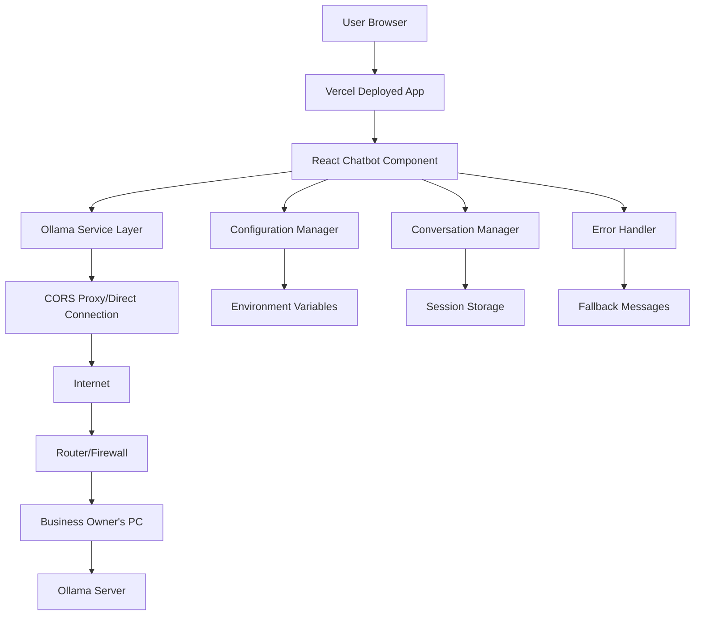
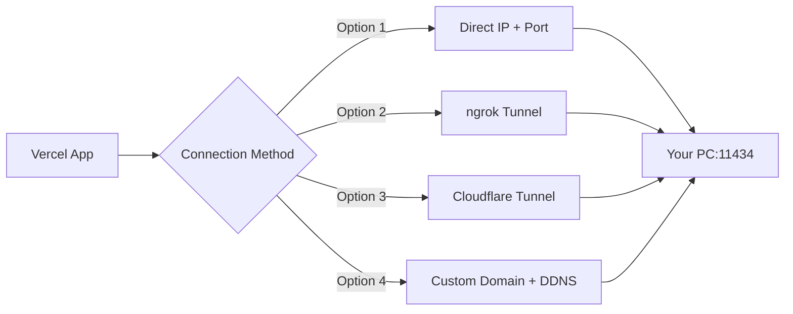
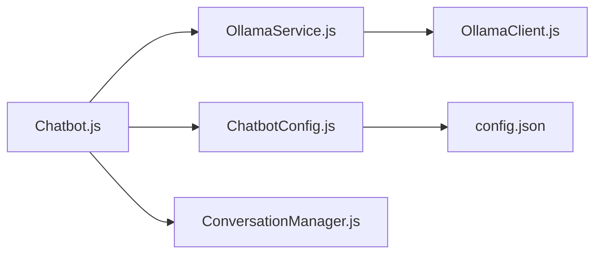
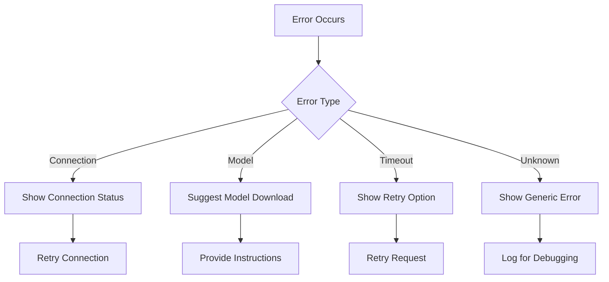

# Design Document

## Overview

This design enhances the existing React chatbot component to enable remote access to a local Ollama installation. The deployed website on Vercel will connect to Ollama running on the business owner's PC, allowing customers to interact with the AI while keeping the processing power and data on the owner's hardware. This design addresses the unique challenges of remote connectivity, CORS handling, network reliability, and secure exposure of local services.

## Architecture

### High-Level Architecture



### Network Architecture Options



### Component Structure



## Components and Interfaces

### 1. Enhanced Chatbot Component (Chatbot.js)

**Responsibilities:**
- UI rendering and user interaction
- State management for messages and UI states
- Integration with Ollama service layer
- Error display and user feedback

**Key Enhancements:**
- Connection status indicator
- Model selection UI (optional)
- Better error messaging
- Configuration loading
- Improved loading states

### 2. Ollama Service Layer (OllamaService.js)

**Responsibilities:**
- Abstract Ollama API interactions
- Handle connection management
- Manage conversation context
- Implement retry logic and error handling

**Interface:**
```javascript
class OllamaService {
  constructor(config)
  async checkConnection()
  async listModels()
  async sendMessage(message, conversationHistory)
  async streamResponse(message, conversationHistory, onChunk)
  getConnectionStatus()
  updateConfig(newConfig)
}
```

### 3. Configuration Manager (ChatbotConfig.js)

**Responsibilities:**
- Load and validate configuration
- Provide default settings
- Handle configuration updates
- Environment-specific settings

**Configuration Schema:**
```javascript
{
  ollama: {
    baseUrl: process.env.REACT_APP_OLLAMA_URL || "http://localhost:11434",
    model: process.env.REACT_APP_OLLAMA_MODEL || "mistral-nz-cars",
    timeout: 45000, // Longer timeout for remote connections
    retryAttempts: 3,
    corsMode: process.env.NODE_ENV === 'production' ? 'cors' : 'no-cors'
  },
  chat: {
    maxHistoryLength: 10,
    systemPrompt: "You are a helpful car buying assistant...",
    fallbackMessages: {
      connectionError: "I'm having trouble connecting to our AI service. Please try again in a moment.",
      timeout: "The AI service is taking longer than expected. Please try again.",
      modelNotFound: "The AI model is temporarily unavailable.",
      serviceOffline: "Our AI assistant is currently offline. Please try again later."
    }
  },
  ui: {
    showConnectionStatus: true,
    enableModelSelection: false,
    typingIndicatorDelay: 500,
    maxRetryAttempts: 3,
    retryDelay: 2000
  },
  network: {
    healthCheckInterval: 30000,
    corsProxy: process.env.REACT_APP_CORS_PROXY,
    useProxy: process.env.REACT_APP_USE_PROXY === 'true'
  }
}
```

### 4. Conversation Manager (ConversationManager.js)

**Responsibilities:**
- Manage conversation history
- Format messages for Ollama
- Handle context window limits
- Session management

**Interface:**
```javascript
class ConversationManager {
  constructor(maxHistoryLength)
  addMessage(message, isBot)
  getFormattedHistory()
  clearHistory()
  getContextForOllama()
  manageContextWindow()
}
```

### 5. Ollama Client (OllamaClient.js)

**Responsibilities:**
- Direct API communication with Ollama
- Handle HTTP requests and streaming
- Connection health checks
- Model management

**Interface:**
```javascript
class OllamaClient {
  constructor(baseUrl, timeout)
  async ping()
  async listModels()
  async generate(model, prompt, options)
  async generateStream(model, prompt, options, onChunk)
  async pullModel(modelName)
}
```

## Data Models

### Message Model
```javascript
{
  id: string,
  text: string,
  isBot: boolean,
  timestamp: Date,
  status: 'sent' | 'delivered' | 'error'
}
```

### Configuration Model
```javascript
{
  ollama: {
    baseUrl: string,
    model: string,
    timeout: number,
    retryAttempts: number,
    parameters: {
      temperature: number,
      max_tokens: number,
      top_p: number
    }
  },
  chat: {
    maxHistoryLength: number,
    systemPrompt: string,
    fallbackMessages: object
  },
  ui: {
    showConnectionStatus: boolean,
    enableModelSelection: boolean,
    typingIndicatorDelay: number
  }
}
```

### Connection Status Model
```javascript
{
  status: 'connected' | 'disconnected' | 'connecting' | 'error',
  lastChecked: Date,
  availableModels: string[],
  currentModel: string,
  error: string | null
}
```

## Error Handling

### Error Categories

1. **Connection Errors**
   - Ollama server not running
   - Network connectivity issues
   - Invalid base URL

2. **Model Errors**
   - Model not found
   - Model loading failures
   - Insufficient resources

3. **Request Errors**
   - Timeout errors
   - Invalid parameters
   - Rate limiting

4. **Response Errors**
   - Malformed responses
   - Streaming interruptions
   - Context window exceeded

### Error Handling Strategy



### Fallback Mechanisms

1. **Graceful Degradation**: Show helpful error messages instead of breaking
2. **Retry Logic**: Automatic retries with exponential backoff
3. **Offline Mode**: Basic predefined responses when Ollama is unavailable
4. **User Guidance**: Clear instructions for resolving common issues

## Testing Strategy

### Unit Tests

1. **OllamaService Tests**
   - Connection handling
   - Message formatting
   - Error scenarios
   - Configuration validation

2. **ConversationManager Tests**
   - History management
   - Context window handling
   - Message formatting

3. **OllamaClient Tests**
   - API communication
   - Streaming responses
   - Error handling

### Integration Tests

1. **End-to-End Chat Flow**
   - Complete conversation scenarios
   - Error recovery testing
   - Configuration changes

2. **Ollama Integration**
   - Real Ollama server communication
   - Model switching
   - Connection recovery

### Manual Testing Scenarios

1. **Connection States**
   - Ollama running vs not running
   - Network disconnection
   - Server restart scenarios

2. **Model Management**
   - Different model types
   - Model not available
   - Model switching

3. **User Experience**
   - Long response times
   - Multiple rapid messages
   - Configuration changes

## Implementation Considerations

### Performance Optimizations

1. **Streaming Responses**: Continue using streaming for real-time feedback
2. **Connection Pooling**: Reuse connections where possible
3. **Debounced Requests**: Prevent rapid-fire requests
4. **Context Management**: Efficient history trimming

### Security Considerations

1. **Local-Only Communication**: All data stays on local machine
2. **Input Validation**: Sanitize user inputs
3. **Configuration Security**: Validate configuration parameters
4. **Error Information**: Avoid exposing sensitive system information

### Scalability Considerations

1. **Multiple Models**: Support for switching between models
2. **Configuration Profiles**: Different settings for different use cases
3. **Plugin Architecture**: Extensible for future enhancements
4. **Resource Management**: Monitor and manage system resources

### Browser Compatibility

1. **Fetch API**: Use modern fetch with polyfills if needed
2. **Streaming Support**: Handle browsers with limited streaming support
3. **Local Storage**: Use for configuration persistence
4. **Error Boundaries**: React error boundaries for graceful failures

## Remote Access Setup Options

### Option 1: Direct IP + Port Forwarding
**Pros:** Simple setup, direct connection
**Cons:** Security risks, dynamic IP issues, firewall complexity

**Setup Steps:**
1. Configure router port forwarding (11434 → PC)
2. Set up dynamic DNS if needed
3. Configure Ollama to accept external connections
4. Set environment variable: `REACT_APP_OLLAMA_URL=http://your-ip:11434`

### Option 2: ngrok Tunnel
**Pros:** Easy setup, HTTPS support, no firewall config
**Cons:** Free tier limitations, tunnel URL changes

**Setup Steps:**
1. Install ngrok on your PC
2. Run: `ngrok http 11434`
3. Use the provided HTTPS URL
4. Set environment variable: `REACT_APP_OLLAMA_URL=https://abc123.ngrok.io`

### Option 3: Cloudflare Tunnel
**Pros:** Free, secure, stable URLs, HTTPS
**Cons:** More complex setup

**Setup Steps:**
1. Install cloudflared on your PC
2. Create tunnel: `cloudflared tunnel create ollama-tunnel`
3. Configure tunnel to point to localhost:11434
4. Set environment variable: `REACT_APP_OLLAMA_URL=https://ollama.yourdomain.com`

### Option 4: Custom Domain + DDNS
**Pros:** Professional, stable, brandable
**Cons:** Requires domain, more setup

## CORS Handling Strategy

### Development vs Production
```javascript
// Development (localhost to localhost)
const config = {
  mode: 'no-cors', // Same origin
  credentials: 'same-origin'
}

// Production (Vercel to your PC)
const config = {
  mode: 'cors',
  credentials: 'omit',
  headers: {
    'Content-Type': 'application/json',
    'Access-Control-Allow-Origin': '*'
  }
}
```

### Ollama CORS Configuration
Your PC's Ollama needs to be configured to accept requests from Vercel:

```bash
# Set environment variable on your PC
export OLLAMA_ORIGINS="https://your-app.vercel.app,https://*.vercel.app"

# Or in Ollama config
OLLAMA_HOST=0.0.0.0:11434
OLLAMA_ORIGINS=https://your-app.vercel.app
```

## Network Reliability Features

### Connection Health Monitoring
```javascript
class ConnectionMonitor {
  constructor(ollamaUrl) {
    this.url = ollamaUrl;
    this.isHealthy = false;
    this.lastCheck = null;
    this.checkInterval = 30000; // 30 seconds
  }

  async startMonitoring() {
    setInterval(() => this.healthCheck(), this.checkInterval);
  }

  async healthCheck() {
    try {
      const response = await fetch(`${this.url}/api/tags`, {
        method: 'GET',
        timeout: 5000
      });
      this.isHealthy = response.ok;
      this.lastCheck = new Date();
    } catch (error) {
      this.isHealthy = false;
      this.lastCheck = new Date();
    }
  }
}
```

### Retry Logic with Exponential Backoff
```javascript
class RetryHandler {
  async executeWithRetry(operation, maxRetries = 3) {
    for (let attempt = 1; attempt <= maxRetries; attempt++) {
      try {
        return await operation();
      } catch (error) {
        if (attempt === maxRetries) throw error;
        
        const delay = Math.min(1000 * Math.pow(2, attempt - 1), 10000);
        await new Promise(resolve => setTimeout(resolve, delay));
      }
    }
  }
}
```

## Security Considerations for Remote Access

### Network Security
1. **HTTPS Only**: Always use HTTPS for production
2. **Origin Validation**: Configure Ollama to only accept requests from your domain
3. **Rate Limiting**: Implement client-side rate limiting
4. **Input Sanitization**: Validate all inputs before sending to Ollama

### Firewall Configuration
```bash
# Example iptables rules for your PC
# Allow only HTTPS traffic to Ollama port
iptables -A INPUT -p tcp --dport 11434 -m conntrack --ctstate NEW,ESTABLISHED -j ACCEPT
iptables -A OUTPUT -p tcp --sport 11434 -m conntrack --ctstate ESTABLISHED -j ACCEPT

# Block all other traffic to that port
iptables -A INPUT -p tcp --dport 11434 -j DROP
```

### Environment Variables for Deployment
```bash
# Vercel environment variables
REACT_APP_OLLAMA_URL=https://your-tunnel-url.ngrok.io
REACT_APP_OLLAMA_MODEL=mistral-nz-cars
REACT_APP_USE_PROXY=false
REACT_APP_CORS_PROXY=
NODE_ENV=production
```